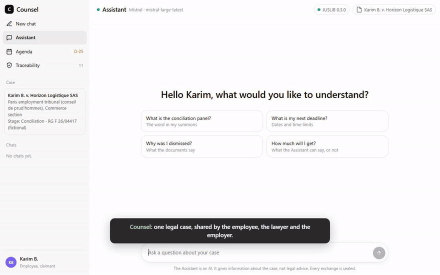

# Counsel

LLM x Law Hackathon Paris #2 (Mistral AI, Stanford CodeX, Sciences Po), 4 October 2026.



The demo in 55 seconds, with live answers from Mistral: [docs/demo/counsel-demo.mp4](docs/demo/counsel-demo.mp4). Every person, company and document in it is fictional.

Counsel is the lawyer's application for disputes about AI decisions. Underneath, Recognitium seals every AI decision and every bank action where they happen, and binds them together. Article 12 of the AI Act makes logging mandatory for high-risk AI; it does not say how to make logs trustworthy. That is what this does.

## The new app

`app/` holds the application built from the product specification: one shared case, three sections (Assistant, Agenda, Traçabilité), three account types. Run `node app/server.mjs` and open http://localhost:8791. Details in [app/README.md](app/README.md). The pages below are the earlier prototype.

## Open it

No server, no install, no internet needed (except to open the public receipt links). Double-click `index.html`, full screen, at least 1000 px wide.

One menu on every page, in three groups:

| Group | Entry | What it shows |
|---|---|---|
| Practice | **Agenda** | The lawyer's week. Planning that never moves a client's deadline; an urgent matter is absorbed by delegation, not by moving another client. |
| Practice | **Matters** | Each matter ranked on its own client's priorities; the approved strategy is fingerprinted. |
| Practice | **AI journal** | Every AI action inside Counsel, append-only and chained; rewrite a past line and the integrity check names it. |
| Disputes | **Credit refusal** · HZ-2026-04417 | Drop the applicant's letter: Counsel finds his 5 AI actions among 200, verifies each against its own receipt, drafts the plain-language explanation (live by Mistral through the relay), refuses any figure the log does not contain, and exports a self-verifying evidence file. |
| Disputes | **Disputed transfer** · INV-2209 | A transfer, then the customer's conversation about it and the assistant's tool calls. Counsel proves what belongs together, what answered what and in which order without reading any content, then checks the disclosed answer against the disclosed transfer. |
| Disputes | **Chatbot promise** · C-0903-1841 | The customer says the assistant promised 30 days; 3 of 12 messages disclosed; the sealed answer says 14 days. Undisclosed messages stay salted fingerprints. |
| Controls | **Decision to action** | Any action taken on an AI decision, bound to that decision and its human review by fingerprint, in sealed order. Example: a loan approval, its review and the disbursement; and a payment with no decision behind it. The same applies to a job offer after an AI screening or a claim payout after an AI assessment. |
| Controls | **Action gate** | Every action checked against the sealed decisions before it commits. Example: a day of 600 credit decisions and 438 payments, 11 anomalies blocked, the whole day sealed as one Merkle root. |

Files: `index.html` (Practice and Credit refusal), `linked.html`, `conversation.html`, `binding.html` (both Controls), `shell.js` and `shell.css` (the shared header and menu), `server.mjs` (the relay), `PITCH.md`.

Before going on stage: "Reset the demo", at the bottom of the menu on the Practice pages.

## Live Mistral (the explanation draft)

To have Mistral write the plain-language explanation live, serve the pages through the small relay instead of double-clicking. Node 18 or later, nothing to install. In PowerShell, from this folder:

```powershell
$env:MISTRAL_API_KEY = "<your Mistral API key>"
node server.mjs
```

Then open http://localhost:8787. The left menu shows "Mistral connected". In Evidence, "Explain to the applicant" now asks Mistral (default `mistral-large-latest`; set `$env:MISTRAL_MODEL` to change it) to draft the letter from the sealed lines only. Counsel still checks every figure against the log: change 412 to 432 and approval is refused, whatever the model wrote. The key stays in the relay, never in the browser. Without the relay, or if Mistral does not answer, the draft falls back to rules and the page says so.

## What is real, what is not

- The firm, the bank, the customers and every log are **fictional**.
- The receipts are **real**, sealed on Recognitium's production chain on 4 October 2026. Anyone can open them at `https://www.recognitium.com/verify/<receipt id>`. Only fingerprints (32 bytes) were ever sent.
- The plain-language draft is written live by Mistral when the relay runs with a key; otherwise by rules. The letter reading is still rules.
- A receipt proves when a record existed and that it has not changed since. It does not prove that the AI decision was right.

## Do not edit

The bank log in `index.html` (`LOG`), the messages and random values in `conversation.html` (`MSGS`, `SALTS`) and the events and stream in `binding.html` (`CASES`, `STREAM`) are sealed byte for byte. Change one character and the real receipts stop matching. Change the interface freely.

## Next steps for the team

- Letter reading by Mistral (reference, legal bases, deadline), through the same relay.
- Connect Recognitium's MCP server to Le Chat as a custom connector, so Mistral itself can seal and verify.
- Evidence file export for the chatbot case.
